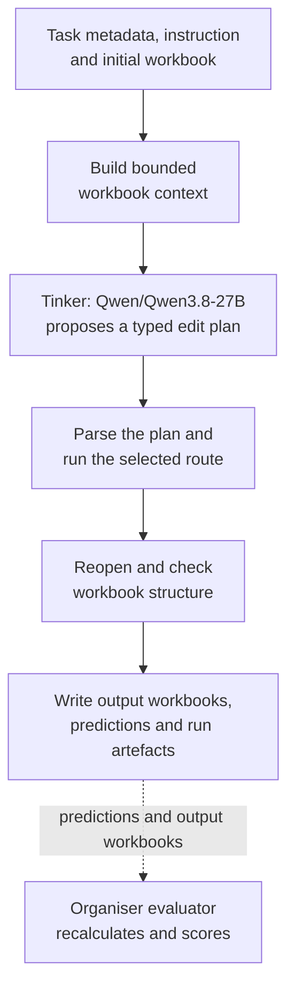

# ExactSource

[](https://github.com/MasteraSnackin/ExactSource/actions/workflows/ci.yml)

ExactSource turns a written SpreadsheetBench instruction and an initial Excel
workbook into an edited workbook with a trace of how it was produced. It is the
Track 1 research entry for the Ylookup × Encode Rebuild Private Markets
Hackathon.

Cell-level tasks use typed spreadsheet operations. Sheet-level tasks can use the
same operations or a restricted Python transform. Every model call uses
`Qwen/Qwen3.8-27B` through Tinker.

## Contents

- [Quick start](#quick-start)
- [How it works](#how-it-works)
- [Architecture](#architecture)
- [Outputs and official score](#outputs-and-official-score)
- [Known limits](#known-limits)

## Quick start

You need:

- Docker with a running engine
- A SpreadsheetBench-format dataset containing `dataset.json`
- A Tinker API key in the shell as `TINKER_API_KEY`
- Outbound HTTPS access

The original benchmark archive and golden workbooks are not bundled. The final
submission does include benchmark-derived output workbooks, traces and evaluator
evidence under the terms recorded in [Provenance](PROVENANCE.md). ExactSource was
developed against the organiser's
[pinned research revision](https://github.com/ylookup/encode-hackathon/tree/37d9016264762a25cae49e077cd0893055bd9093/research).

The Docker run does not require `uv` or LibreOffice on the host. The structural
checker, local CLI and test commands below require
[`uv`](https://docs.astral.sh/uv/). The official evaluator also requires
headless LibreOffice.

Keep the API key outside the repository. If you use the git-ignored `.env` file
shown by [`.env.example`](.env.example), load it into the current shell and run:

```sh
set -a
. ./.env
set +a
./run.sh /absolute/path/to/dataset /absolute/path/to/out
unset TINKER_API_KEY TINKER_PROJECT_ID EXACTSOURCE_ALLOW_PAID_TRAINING
```

`run.sh` does not load `.env` itself. It builds `exactsource:local`, passes the
existing key by environment-variable name, mounts the dataset at `/data` as
read-only and writes results to `/out`. The first build needs network access to
pull the pinned images and install the locked packages.

ExactSource does not clear the output directory. It overwrites files for tasks
in the current run but leaves unrelated files in place. Use an empty output
directory for the final run.

## Current evidence

ExactSource completed one clean-start run of all 400 public tasks at solver
commit `8b84dba1d9263e2123b8f15267239b70ff817907`. The unchanged organiser evaluator
graded all 400 predictions with no missing items and no evaluator errors:

| Official metric | Result |
| --- | ---: |
| Overall pass rate | `0.755` (75.5%) |
| Cell accuracy | `0.8006` (80.06%) |
| Cell-level pass rate | `0.7818` (78.18%) |
| Sheet-level pass rate | `0.696` (69.6%) |

The run started at `2026-09-06T00:10:23Z`, ended at
`2026-09-06T06:50:07Z` and took `23,983.52` seconds by the host clock. It wrote
400 predictions, 400 workbooks and 400 task trace files containing 498 trace
records. ExactSource accepted 369 task outputs and emitted 31 readable initial-
workbook fallbacks. A runtime success only establishes that the candidate passed
ExactSource's structural checks; it does not establish benchmark correctness.

The provider reported `5,592,930` output tokens. It reported zero input tokens,
which ExactSource treats as unavailable rather than as evidence that no input
tokens were used. The evaluator took `329.66` seconds with LibreOffice 26.8.0.3.
[`SUBMISSION.md`](SUBMISSION.md) records the full provenance and final artefact
layout. Non-secret aggregate evidence is recorded in
[`experiments/acceptance_10_8b84dba.json`](experiments/acceptance_10_8b84dba.json)
and [`experiments/full_400_8b84dba.json`](experiments/full_400_8b84dba.json).

The optional training workspace contains 16 hand-written synthetic cases, split
into 12 training examples and four tuning examples. Offline preparation used the
pinned Qwen tokenizer, and LibreOffice checks passed for all 13 cases containing
formulas. We have not run paid training or created a checkpoint. These cases have
not changed the submitted inference model.
[`training/README.md`](training/README.md) records what was validated and what
has not yet been run.

## How it works



ExactSource reads the answer ranges, nearby data, existing formulas and workbook
structure. It de-duplicates cell evidence by worksheet and coordinate and keeps
structural headings before body evidence when a large context must be clipped.
Tinker receives a text request containing this bounded workbook context rather
than the workbook file. The model returns a JSON plan that must match the
route-specific typed schema. ExactSource then runs either declared operations
or, for sheet-level tasks, screened Python against a temporary workbook copy.
Cell-level tasks can only use built-in operations.

Before publishing a successful candidate, ExactSource checks that it opens and
still contains every answer sheet named by the task. If a task ultimately fails,
ExactSource checks that the initial workbook is readable, writes it to that
task's output path and continues with the batch.

These checks establish the runtime's structural output contract. The organiser's
evaluator separately recalculates the workbook and decides whether its contents
are correct.

## Architecture

For the technical design behind the overview above, read
[`docs/ARCHITECTURE.md`](docs/ARCHITECTURE.md). It documents the system
boundaries, task pipeline, components, data flow, failure handling, concurrency,
observability, security controls and design trade-offs. The solve path and the
organiser's evaluator are kept separate so it is clear what ExactSource controls
and what the benchmark scores.

## Outputs and official score

A complete run produces:

```text
out/
  predictions.jsonl
  outputs/<id>.xlsx
  traces/<id>.jsonl
  run_metrics.json
  run.log
```

A full run writes one prediction per dataset task in dataset order. A development
run using `--ids` writes one prediction per selected task, also in dataset order.
Every selected task receives a workbook and a trace file. A task that fails
before its first model request has an empty trace and an error status.

An `ok` status means that ExactSource accepted the plan and reopened the output
workbook successfully. It does not mean that the workbook passed
SpreadsheetBench.

### Check the output structure

This command checks the output layout, workbooks, traces and metrics without
reading golden workbooks:

```sh
uv run --frozen python tools/check_submission.py \
  --dataset-dir /absolute/path/to/dataset \
  --submission-dir /absolute/path/to/out
```

Use this command for a complete run against the supplied `dataset.json`. A
development output created with `--ids` needs a matching subset
`dataset.json`.

### Calculate the official score

Use the organiser's evaluator for the official result. It runs outside the
inference image and recalculates workbooks with headless LibreOffice:

```sh
cd /absolute/path/to/encode-hackathon/research
uv run evaluate.py \
  --dataset-dir /absolute/path/to/dataset \
  --predictions /absolute/path/to/out/predictions.jsonl \
  --all \
  --out /absolute/path/to/ExactSource/results.json
```

Keep the host-level elapsed time with the final result:

```sh
/usr/bin/time -p ./run.sh /absolute/path/to/dataset /absolute/path/to/out
```

`run_metrics.json` records task outcomes, model attempts, retries, ordinary
repairs, max-token recoveries, token usage, character counts and latency. Missing
measurements remain unknown rather than becoming zero. The only exception is
Tinker's optional cache counters,
which become zero when the protocol omits them or returns null.
[The architecture document](docs/ARCHITECTURE.md#observability) explains the
metric schema and timing boundary.

## Fixed configuration

Inference settings live in `src/exactsource/config.py`:

| Setting | Value |
| --- | --- |
| Provider | Tinker Anthropic-compatible streaming endpoint |
| Model | `Qwen/Qwen3.8-27B` |
| Temperature | `0` |
| Cell initial request and ordinary semantic repair | `16,000` tokens, reasoning requested with the supported Boolean setting |
| Sheet initial request and ordinary semantic repair | `32,000` tokens, reasoning requested with the supported Boolean setting |
| Initial cell `max_tokens` recovery | One fresh `32,000`-token, no-think-requested completion with Boolean reasoning disabled, `/no_think` and an empty-thinking prefill |
| Transport retries | `2` after the first attempt |
| Second-call allowance | `1`: either an ordinary semantic repair or the initial-cell truncation recovery; never a third call |
| Concurrent tasks | `4` |
| Workbook context sent to the model | Up to `48,000` characters |
| Prompt text saved per trace record | Up to `20,000` characters |

The cell truncation recovery starts from the original request and does not replay
the truncated response. Its controls bias the completion towards the answer, but
provider compliance with the no-think request is not guaranteed. A truncated
sheet request, a truncated ordinary repair or a truncated cell recovery does not
open another logical model call. Transport retries remain bounded separately for
each logical call.

The model receives up to 48,000 characters of workbook context. Trace files store
a separately shortened copy of the prompt, limited to 20,000 characters. Model
responses remain untruncated after secret redaction. Accepted plan evidence is
stored without trace truncation.

Built-in operation plans are limited to 128 operations, 250,000 cells per
operation and 500,000 destination writes in total. Judge runs cannot override the
provider or model.

`TINKER_API_KEY` is the only required runtime credential. ExactSource does not
use GCP or Gemini credentials. The optional paid training experiment requires
four explicit checks documented in
[`docs/TINKER_COOKBOOK.md`](docs/TINKER_COOKBOOK.md).

## Local development

ExactSource targets Python 3.11 to 3.13. The core runtime uses `httpx`,
`openpyxl` and `pydantic`. `uv` manages the locked environment, Pytest and Ruff
provide local checks, and Docker packages the judge run.

Run the package without Docker:

```sh
uv sync --frozen --group dev
uv run --frozen exactsource \
  --data-dir /absolute/path/to/dataset \
  --out-dir /absolute/path/to/out
```

For a small development run, add one or more task IDs:

```sh
uv run --frozen exactsource \
  --data-dir /absolute/path/to/dataset \
  --out-dir /absolute/path/to/out \
  --ids 41691
```

The data and output directories must not overlap. A direct CLI run also requires
`TINKER_API_KEY`. View all options with:

```sh
uv run --frozen exactsource --help
```

Run the local checks with:

```sh
uv sync --frozen --group dev
uv run --frozen ruff check .
uv run --frozen ruff format --check .
uv run --frozen pytest
uv run --project training --frozen pytest training/tests
```

These tests cover the input boundary, workbook inspection, plans, formula
screening, restricted transforms, task isolation and submission artefacts. They
do not replace the organiser's workbook evaluation.

GitHub Actions repeats the locked lint, formatting, test and build checks on
Python 3.11–3.13, enforces an 80% branch-coverage floor, tests the isolated
training workspace and smoke-tests the submission image. External actions are
pinned to complete commit SHAs and checkout credentials are not persisted.

## Demo and submission

The submission demo shows a batch run rather than a graphical interface.
[`docs/DEMO.md`](docs/DEMO.md) outlines a three-minute recording using real
workbooks, formula-bar checks, traces and unedited evaluator results.

The full benchmark result and reproducibility evidence are recorded in
[`SUBMISSION.md`](SUBMISSION.md). Before submission, the remaining human-owned
steps are:

- Add the confirmed team members and demo link
- Record the demo against the published artefacts and unedited evaluator result

## Known limits

- ExactSource can produce a valid but logically wrong plan. Only held-out
  evaluation can establish spreadsheet correctness.
- The completed public run produced 31 safe initial-workbook fallbacks. These
  preserve one readable output per task, but they are not runtime-accepted model
  solutions. One unchanged workbook nevertheless matched its evaluator target.
- Runtime success is not correctness: 369 tasks passed ExactSource's structural
  acceptance checks, while the official evaluator independently measured the
  workbook results.
- Temperature zero did not make repeated Tinker completions fully deterministic;
  output variance was observed during development.
- Tinker reported input-token counts as zero for the full run. ExactSource treats
  those values as unavailable, so the reported token total covers output only.
- No fine-tuning was performed. The submitted solver uses the unmodified
  `Qwen/Qwen3.8-27B` base model with prompting, typed plans and deterministic
  execution checks.
- The inference image does not recalculate formulas. The organiser's evaluator
  performs that step with LibreOffice.
- `openpyxl` warns that it may remove unsupported OOXML data-validation
  extensions. A workbook can therefore reopen successfully while losing that
  unsupported metadata.
- Seven evaluated output workbooks retain external-link metadata inherited from
  the supplied public initial workbooks. ExactSource introduced none of those
  targets, but some are HTTPS links that a spreadsheet client could contact if
  external updates are enabled. Keep external-link updates disabled when
  inspecting untrusted benchmark files; [Provenance](PROVENANCE.md) records the
  publication boundary.
- Built-in operations are confined to declared answer ranges. The runner screens
  Python transforms and applies resource limits, but it does not yet compare
  every cell and OOXML part before and after execution.
- ExactSource records parsing, safety, execution and structural failures that it
  detects. Logical errors and unsupported metadata changes may go undetected.
- Generated Python runs with reduced privileges and resource controls inside the
  submission container. These controls limit access but do not make
  model-generated Python safe for general-purpose use.
- Formula checks reject visible references to external workbooks, legacy
  integrations and external services, malformed structural delimiters and
  explicit references to absent worksheets. A narrow deterministic check also
  rejects a literal `VLOOKUP` or `HLOOKUP` return index that is provably outside
  a bounded static A1 table range. The checks do not otherwise prove function
  availability, function arity, dynamic targets or calculated results.
  `INDIRECT(A1)` remains valid when its formula text contains no external target.
  The checks reject generated `HYPERLINK` and `IMAGE` calls. `copy_range` rejects
  OOXML what-if data-table formulas because it cannot relocate them safely.
- Every contributing model call uses `Qwen/Qwen3.8-27B`. No second model acts as
  a router, judge or fallback.

## Documentation

- [System architecture](docs/ARCHITECTURE.md): components, data flow, security
  boundaries and trade-offs
- [Evaluation protocol](docs/EVALUATION.md): scoring, held-out checks and
  experiment discipline
- [Final-run analysis](docs/FINAL_RUN_ANALYSIS.md): generation funnel,
  correctness, failure causes, latency and token efficiency
- [Tinker Cookbook path](docs/TINKER_COOKBOOK.md): optional training and its
  paid-run checks
- [Organiser clarifications](docs/ORGANISER_CLARIFICATIONS.md): dated rules and
  unresolved questions
- [Demo plan](docs/DEMO.md): evidence to show in the submission video
- [Training workspace](training/README.md): synthetic cases and offline checks
- [Experiments](experiments/README.md): controls, probes and case-level results
- [Provenance](PROVENANCE.md): upstream revision, checksums and licence boundary

## Support and licence

Open a [GitHub issue](https://github.com/MasteraSnackin/ExactSource/issues) with
the task ID, exact command and a redacted error or trace excerpt. Do not attach
API keys, private workbook data or golden workbooks.

ExactSource source code is released under the [MIT licence](LICENSE).
Benchmark-derived output workbooks, trace context and evaluator evidence are
published under the SpreadsheetBench CC BY-SA 4.0 terms described in
[Provenance](PROVENANCE.md). The original archive and golden workbooks are not
bundled.
