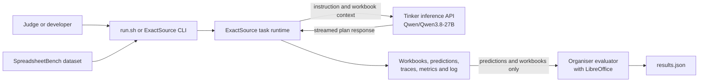
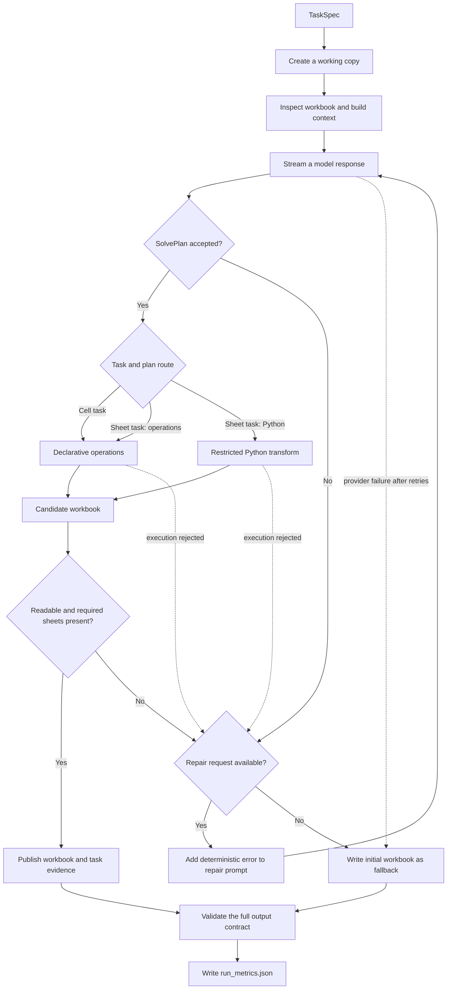

# ExactSource system architecture

ExactSource is a batch spreadsheet-transformation system for the Ylookup ×
Encode research track. It reads a SpreadsheetBench task and its initial workbook,
uses the fixed `Qwen/Qwen3.8-27B` model to propose a typed edit plan, then writes
the resulting workbook and run evidence to disk.

There is no web client, application server or database. The main boundary is a
single command-line process that reads files, calls Tinker over HTTPS and creates
files for the organiser's separate evaluator.

## Architecture goals

These requirements shape the design:

- Use `Qwen/Qwen3.8-27B` for every model call that contributes to an output
  workbook.
- Read only organiser-supplied task metadata, the instruction and the initial
  workbook during inference. Golden workbooks must stay outside the solve path.
- Support focused formula edits without asking the model to reproduce every cell
  in a large target range.
- Support broader sheet operations when a cell-by-cell plan would be a poor fit.
- Keep provider retries, plan repairs and task concurrency bounded.
- Produce one workbook and one runtime status for every selected task.
- Record each provider attempt, retry, repair and timing measurement needed to
  inspect a run.
- Keep formula recalculation and correctness scoring in the organiser's
  evaluator.

## System context

The Docker wrapper mounts the dataset at `/data` as read-only and the result
directory at `/out` as writable. ExactSource sends a bounded text description of
the task and workbook to Tinker. The organiser's evaluator later recalculates and
scores the saved workbooks.

## Task pipeline

Cell-level tasks can only use declarative operations. A sheet-level task may use
either route. All edits happen on a temporary working copy. The first parse,
execution or answer-sheet validation failure can trigger one repair request. If
the repair also fails, the runner discards the edited workbook and writes the
initial workbook to that task's output path.

## Components

| Component | Source | Responsibility | Data and interfaces |
| --- | --- | --- | --- |
| Docker wrapper and CLI | `run.sh`, `Dockerfile`, `src/exactsource/cli.py` | Validate run paths, prepare logging, load tasks and start the fixed worker pool | Reads `/data`, writes `/out` and reads `TINKER_API_KEY` from the environment |
| Dataset loader | `src/exactsource/dataset.py`, `src/exactsource/ranges.py` | Parse `dataset.json`, resolve task folders, find the single initial workbook and normalise answer ranges | Produces an ordered list of `TaskSpec` objects |
| Workbook inspector | `src/exactsource/workbook.py`, `src/exactsource/context.py` | Read formulas and workbook structure, gather target-aware cell evidence and fit it into the context budget | Produces one `ContextPack` per task |
| Prompt and plan contracts | `src/exactsource/prompts.py`, `src/exactsource/contracts.py` | Build route-specific prompts and define the strict JSON shape accepted from the model | Cell tasks receive an operations-only schema. Sheet tasks receive an operations-or-Python schema |
| Tinker adapter | `src/exactsource/model.py` | Send the fixed request, decode server-sent events, apply transport retries and return model text plus usage evidence | HTTPS to Tinker, with one trace record per provider attempt |
| Declarative executor | `src/exactsource/plans.py`, `src/exactsource/formula_safety.py` | Check destination ranges and resource limits, then apply typed cell and range operations | Reads and writes the task's temporary workbook |
| Python transform runner | `src/exactsource/sandbox.py`, `src/exactsource/formula_safety.py` | Screen model-written code and run `transform(wb)` in a restricted child process | Receives fixed staged workbook paths and a stripped environment |
| Task coordinator | `src/exactsource/runner.py` | Run tasks concurrently, isolate failures, allow at most one semantic repair and preserve dataset order in final predictions | Coordinates the model, both execution routes and task artefacts |
| Artefact and metric layer | `src/exactsource/artifacts.py`, `src/exactsource/metrics.py` | Write workbooks and JSONL files atomically, validate the output contract and derive run metrics | Owns `predictions.jsonl`, `outputs/`, `traces/`, `run_metrics.json` and `run.log` |
| Official evaluator | Organiser `research/evaluate.py` | Recalculate workbooks with LibreOffice and compute benchmark metrics | Reads ExactSource predictions and writes `results.json` outside the inference runtime |

## Data flow

1. The CLI resolves the dataset and output directories, rejects overlap and
   starts a run log.
2. The dataset loader reads `dataset.json` in order. For each task it resolves
   the declared folder, reads `prompt.txt` or the instruction field, and opens
   the single non-golden `*init*.xlsx` workbook.
3. The runner copies the initial workbook to a task-specific temporary file.
4. The inspector reads formulas, sheet dimensions, tables, defined names, merged
   cells and selected cell evidence. It removes duplicate cell evidence in
   answer-region, declared-data, formula-pattern and sparse-sample order. If the
   context needs truncation, workbook structure keeps a protected allocation and
   the other sections share the remaining budget.
5. The prompt builder combines the task metadata, instruction, bounded workbook
   context and the schema allowed for that task type.
6. The Tinker adapter streams a response from `Qwen/Qwen3.8-27B`. Each provider
   attempt becomes one trace record, including retryable failures.
7. Pydantic parses the response as a `SolvePlan`. A rejected plan may receive one
   repair call containing the deterministic parse or apply error, but no golden
   feedback.
8. The selected executor edits a candidate workbook. Formula capability checks
   apply to formulas introduced or changed by the plan.
9. The runner reopens the candidate and checks that every declared answer sheet
   still exists. It then moves the workbook into the output directory using an
   atomic replacement. If the task still fails after the allowed retries and
   repair, the runner writes the initial workbook to the expected output path
   and continues.
10. After all workers finish, the coordinator writes predictions in dataset
    order, validates every selected task artefact and publishes
    `run_metrics.json`.
11. The organiser's evaluator independently recalculates the outputs and
    computes pass rate and cell accuracy.

A task status of `ok` records pipeline success through structural validation. It
does not assert that the resulting formulas or values are correct.

## Data and artefact model

Runtime objects stay in memory. Workbooks, predictions, traces, metrics and logs
are written to the output directory.

| Item | Cardinality | Purpose |
| --- | --- | --- |
| `TaskSpec` | One per selected dataset task | Task ID, instruction type, instruction, initial workbook path and declared ranges |
| `ContextPack` | At most one per task, built before the first request and reused for a repair | Bounded workbook text plus original size, truncation state and SHA-256 digest |
| `SolvePlan` | One accepted plan per successful task | Route, short summary and either typed operations or Python source |
| Output workbook | One per selected task | Edited workbook on success, or the initial workbook on failure |
| Prediction | One per selected task | Task ID, relative workbook path and runtime status |
| Trace record | Zero or more per task | One ordered JSON object for each provider attempt, with the final plan evidence attached to the terminal attempt |
| Run metrics | One per completed batch | Totals and distributions derived from predictions, traces and coordinator timings |
| Run log | One per run | Terminal output captured from standard output and standard error |
| Evaluator result | One per official evaluation | Benchmark summary and per-task results produced outside ExactSource |

## Context construction

The workbook inspector loads formulas rather than relying only on cached values.
It records worksheet structure and sparse non-empty cells while keeping
worksheet-qualified coordinates distinct.

The model-visible workbook context has a 48,000-character budget. Task ID,
instruction, answer ranges and data-position metadata appear once in the
top-level user payload rather than being repeated inside that context. When the
complete description is too large, the builder assigns a budget to each section
and inserts explicit omission markers. It keeps range and worksheet headings,
then their status lines, before body evidence when they fit. If the headings
alone do not fit, the context records how many blocks it omitted. The
`ContextPack` and trace record the original character count, emitted character
count and digest.

Trace storage has a different limit. The serialised prompt saved in each trace
record is capped at 20,000 characters by removing its middle and retaining its
beginning and end with truncation metadata. This trace limit does not change the
prompt already sent to the model. Model responses remain untruncated after secret
redaction. Accepted plan evidence is stored without trace truncation.

## Execution routes and workbook preservation

### Declarative operations

The operations route supports:

- `set_value`
- `set_formula`
- `fill_formula`
- `set_array_formula`
- `fill_array_formula`
- `clear_range`
- `copy_range`

For this route, every destination rectangle must fit inside a declared answer
range. Resource bounds are checked before workbook loading. After loading,
destination scope is checked before any operation is applied. Each operation
then validates its worksheets, coordinates and formulas before writing its
cells. The plan may contain at most 128 operations, touch at most 250,000 cells
in one operation and write at most 500,000 destination cells in total.

### Restricted Python transform

Only sheet-level tasks may select the Python route. The runner accepts a single
`transform(wb)` function after abstract-syntax-tree screening. The child receives
fixed workbook paths, a limited helper namespace and a stripped environment.
Resource controls prevent it from starting further child processes. It drops to
an unprivileged identity when the container starts as root.

This route can modify the whole workbook. The prompt tells the model to preserve
unrelated content, but the runtime does not yet compare every cell and OOXML part
before and after the transform. The post-run checks confirm readability, required
answer sheets and changed-formula capability rules. They do not prove complete
preservation.

These controls limit what generated code can access inside the container. They
do not make model-generated Python safe for general-purpose use.

## Infrastructure and deployment

| Environment | Runtime | Inputs and outputs | Notes |
| --- | --- | --- | --- |
| Judge container | Pinned Python 3.12.11 slim image with locked runtime dependencies | `/data` read-only, `/out` writable, Tinker over HTTPS | Starts `exactsource` with no arguments and fixed configuration |
| Local development | Python 3.11 to 3.13 with `uv` | User-supplied paths, with optional `--ids` selection | The CLI resolves the top-level paths and rejects overlap. The dataset loader confines paths inside the dataset root |
| Optional training workspace | Separate `training/` project | Synthetic cases, offline tokenizer cache and explicitly gated Tinker access | Not installed in the inference image and not used by the current model |
| Official evaluation | Organiser research checkout with headless LibreOffice | Dataset, predictions and output workbooks | Recalculates formulas and writes `results.json` |

ExactSource runs on one host and depends on local files plus Tinker. It does not
require a queue, database, Kubernetes or GCP. The first image build needs network
access to retrieve images and packages. Each inference run needs access to
Tinker.

## Concurrency, retries and failure isolation

- The coordinator uses up to four worker threads. It preserves dataset order when
  it writes predictions, regardless of completion order.
- Model responses are streamed with fixed connection, read, write and pool
  timeouts.
- A provider call may retry twice after the first attempt. A parsed or applied
  plan may receive one semantic repair.
- Each task uses separate temporary files and a separate trace recorder. Mutable
  usage counters are not shared between workers.
- Candidate workbooks, predictions, traces and metrics are written to temporary
  files and moved into place atomically.
- A task-level failure does not stop the batch. A malformed dataset, duplicate
  task ID or invalid final artefact set stops the run because ExactSource can no
  longer produce a valid submission from that input.
- Declarative write ceilings and child-process resource limits bound local work.
  The system does not autoscale across machines, and Tinker availability remains
  an external dependency.

## Security and data handling

- The Docker wrapper makes `/data` read-only. The CLI resolves the top-level data
  and output paths and rejects overlap. The dataset loader resolves child paths
  and symlinks, then rejects anything that escapes the dataset root.
- The loader searches only for one `*init*.xlsx` workbook in each declared task
  folder and excludes filenames containing `golden`. Inference does not use
  evaluator mismatch data for repair.
- `TINKER_API_KEY` enters through the environment. The wrapper forwards it by
  variable name instead of a Docker build argument. Provider error messages are
  redacted before ExactSource writes them to logs or traces.
- Model-written code receives neither the provider credential nor arbitrary file
  paths.
- Formula checks reject visible references to external workbooks, legacy
  integrations or external services. They also reject malformed structural
  delimiters and worksheet references that can be parsed confidently and point
  to absent sheets. The checks reject generated `HYPERLINK` and `IMAGE` formulas.
  They do not evaluate function availability, function arity, dynamic targets or
  calculated results. `copy_range` rejects OOXML what-if data-table formulas
  because it cannot relocate them safely.
- The capability check applies only to new or changed formulas. It does not
  re-screen formulas that remain unchanged.
- Formula integrity checking is not semantic data-flow analysis. For example,
  `INDIRECT(A1)` remains allowed when the formula text contains no external
  target syntax.
- The model request contains the task instruction and selected workbook content.
  Before using private data, confirm that its handling rules allow this content
  to be sent to Tinker.

ExactSource is a benchmark runner, not a multi-user service. It has no compliance
certification, user authentication, access control, field-level encryption or
long-term secret store.

## Observability

Each run produces four records:

- `run.log` captures terminal output for the batch.
- `predictions.jsonl` maps each selected task to its workbook and runtime status.
- `traces/<id>.jsonl` stores one ordered record per provider attempt. The
  terminal attempt carries plan parsing, application and tool evidence. A task
  that fails before any provider call has an empty trace.
- `run_metrics.json` schema version 2 summarises outcomes, logical calls,
  provider attempts, retries, repairs, character volumes, token usage and
  latency.

Metrics distinguish known values from unavailable measurements. Token totals
retain `known_sum`, `known_attempts` and `unknown_attempts`. Optional Tinker cache
counters are normalised to zero only when the protocol omits them or returns
null. Invalid non-null counters are rejected, and cache counts are not added to
`input_tokens` a second time.

The internal wall timer starts when batch execution begins and stops after final
artefact validation. It excludes dataset loading, solver creation, metric
publication and Docker startup. Pre-model task timings and batch wall time come
from the coordinator's clock because model traces cannot reconstruct them. The
metrics label these values `coordinator-clock`. The final run should also retain
the independent host-level `/usr/bin/time` result.

ExactSource has no remote monitoring service, so the output files form the audit
record.

## Failure handling

| Failure | Runtime behaviour | Meaning |
| --- | --- | --- |
| Invalid dataset, unsafe path or duplicate task ID | Abort the run with a redacted error | The input contract could not be established |
| Tinker timeout or exhausted transport retries | Record available attempts, write the initial workbook and continue | The task did not produce an accepted model plan |
| Invalid JSON or rejected plan after one repair | Record the rejection, publish the fallback and continue | The response did not meet the typed execution contract |
| Executor error, unsafe formula or invalid candidate workbook | May make one repair request. After exhaustion, discard the edited workbook, write the initial workbook and continue | The edited workbook failed a deterministic runtime check |
| Structurally valid but logically wrong workbook | Publish with `ok` status | The evaluator may still mark the workbook incorrect |
| Unsupported OOXML metadata altered during an `openpyxl` round trip | May pass structural validation | The metadata change falls outside the current structural checks |

Logical mistakes and unsupported metadata changes can remain undetected until
evaluation or manual inspection.

## Design decisions and trade-offs

| Decision | Benefit | Cost or limit |
| --- | --- | --- |
| Fixed model and inference settings | Makes judge runs easier to reproduce and satisfies the model restriction | Prevents runtime model selection and adaptive routing through another model |
| Typed plan instead of prose or a full cell dump | Gives the runtime a small, inspectable execution contract | Valid spreadsheet logic can still be expressed incorrectly by the model |
| Operations-only schema for cell tasks | Constrains writes to answer ranges and makes formula fills compact | Cannot express every possible workbook change |
| Optional Python route for sheet tasks | Handles procedural edits without enumerating a large cell patch | Has a broader mutation surface and weaker preservation guarantees |
| `openpyxl` for inspection and editing | Provides a portable Python implementation with formula access | Does not calculate formulas and may drop unsupported OOXML extensions |
| Initial workbook as the fallback for a failed task | Keeps the batch gradeable and isolates failures | A readable fallback is not a solved task |
| Separate LibreOffice evaluator | Keeps inference independent from scoring and follows the organiser's method | Runtime status alone cannot establish correctness |
| Detailed local traces | Makes retries, repairs and plan application inspectable | Traces can contain workbook content and must be handled as sensitive data |

## Work remaining before submission

The current repository still needs:

- A complete 400-task run and the unedited organiser `results.json`
- A public demo video linked from `SUBMISSION.md`
- A before-and-after preservation audit for the Python route
- Failure analysis based on held-out and final evaluator results

The optional fine-tuning path remains separate. A fine-tuned checkpoint will be
used only if:

- The paid run produces a reproducible checkpoint
- It beats the base-model comparison
- The organiser confirms that it meets the Qwen-only rule

## Related documentation

- [README](../README.md)
- [Evaluation protocol](EVALUATION.md)
- [Tinker Cookbook experiment path](TINKER_COOKBOOK.md)
- [Organiser clarifications](ORGANISER_CLARIFICATIONS.md)
- [Demo plan](DEMO.md)
- [Training workspace](../training/README.md)
- [Provenance](../PROVENANCE.md)
